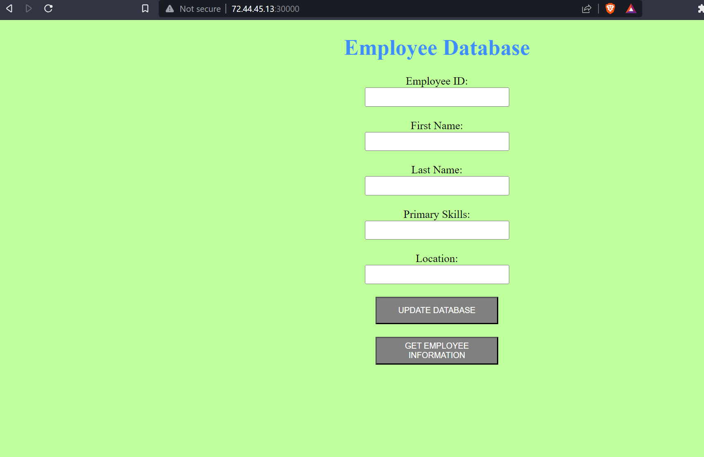

# Welcome to Kubernetes Project :desktop_computer:
#### So below is a small Kubernetes project that I have done as an assignment in my course: Portable Technologies by professor: ***Irina Geiman*** at ***Seneca College.***
### Here we will deploy a 2-tier application using Kubernetes. :exclamation:
This project aims to host a containerized application in the locally simulated single-node K8s cluster. We will use kind tool to create the single node K8s cluster.

 *Our app will consist of a MySQL database and 1 front-end webpage.*

> **Project Outline**
1. Deploy Amazon Linux based EC2 with sufficient capacity to run kind cluster and host our containerized application
2. Install all the pre-requisites on the Amazon EC2 needed to host the containerized application on K8s cluster created by kind (kind, kubectl, docker).
3. Create K8s cluster using kind tool.
4. Deploy containerized application using pod, replicaset , deployment and service manifests.
5. Expose web application using Service of type NodePort
6. Expose MySQL using Service of type ClusterIP
7. Update the applications and deploy the new version of the application.

> ***SoMe UsEfuL coMManDs:***

```
 kubectl create ns <namespace>

 kubectl apply -f path/to/manifest-file.yaml -n <namespace>
 
 kubectl get all -n <namespace>
 
 kubectl describe <resource-name> -n <namespace>
 
 kubectl delete <resource-name> -n <namespace>

```

> ***Output***


